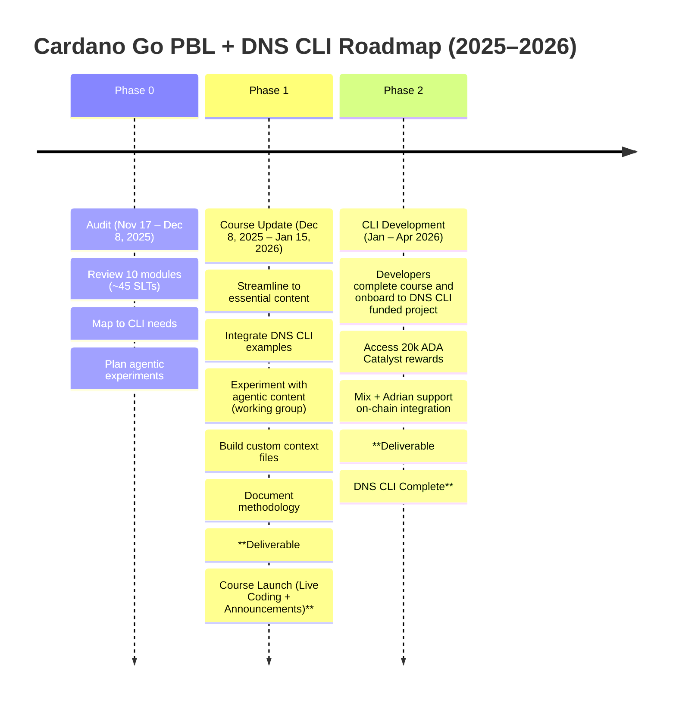

# README for Cardano Go course development

This repository houses the work for a **Project Catalyst–funded collaboration** between **Gimbal Labs** and **Blink Labs** to update and expand the *Cardano Go* course. The course teaches **Cardano development using Go tooling**, including Bursa, Apollo, Adder, and other tools created by Blink Labs.

## Project Scope

This project covers the full lifecycle of updating the Cardano Go curriculum and onboarding developers into real-world Cardano tooling. Work is organized into three phases and managed transparently here on GitHub.

## Phases

* **Phase 0: Audit** – Review existing modules and plan required updates.
* **Phase 1: Course Update** – Streamline lessons, integrate new examples, and prepare the updated course for release.
* **Phase 2: CLI Development** – Support developers as they complete the course and contribute to the funded DNS CLI project.

## Communication

* **Weekly Meetings:** Held on Zoom.
* **Team Discussions:** Hosted in the Gimbal Labs Discord.

## Purpose

Provide a clear structure for contributors, document project progress, and serve as the central hub for project management, discussion, and deliverables.

## Links

* [Gimbalabs proposal document](https://gimbalabs.notion.site/DNS-CLI-Development-Cardano-Go-Course-Update-2a30db6d1d5d8077aaf7f9b98faaa661?source=copy_link)
* [Andamio course](https://app.andamio.io/course/fd28cf17d1869bcb1f1f3ceaa7daf02d14358ba74691fd679ba3b633)
* Partner [Blinklabs.io](https://blinklabs.io/)
* [Funding source Project Catalyst Proposal](https://projectcatalyst.io/funds/13/cardano-open-developers/decentralized-domain-name-system-dns-marketplace-powered-by-cardano-and-handshake-blockchains)
