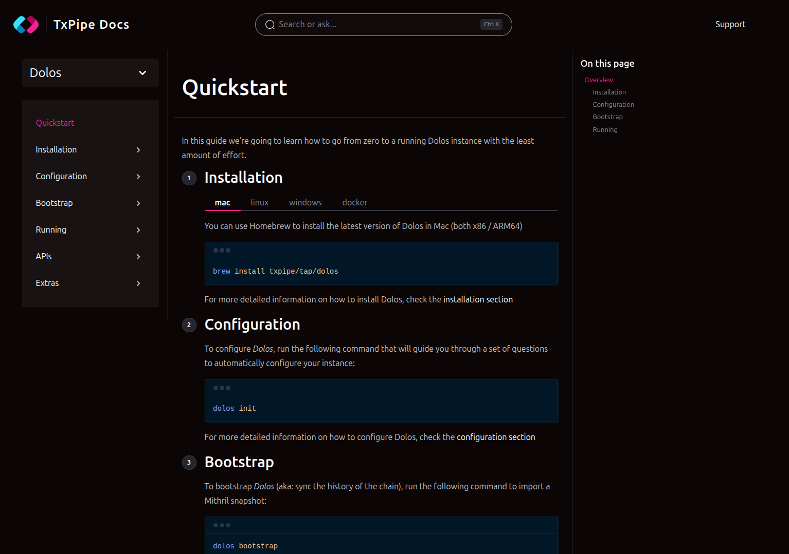
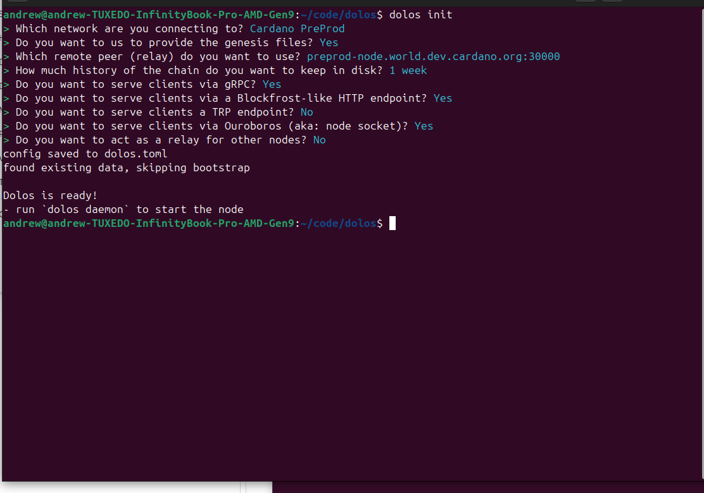

# Setting Up Dolos

Several modules in this course require a local source of Cardano chain data. That source is **Dolos** — a lightweight data node you run on your own machine. This lesson explains what Dolos is, what problem it solves, and how to get it running configured for the preprod testnet.

---

## What Is Dolos?

[Dolos](https://github.com/txpipe/dolos) is a **Cardano data node** built by [TxPipe](https://txpipe.io), written in Rust. It is not a full Cardano node — it does not validate blocks, produce blocks, or participate in consensus. It does one thing: keep a local, up-to-date copy of the chain and serve that data to clients through several APIs.

From the official docs:

> *"keeping an updated copy of the ledger and replying to queries from trusted clients, while requiring a small fraction of the resources."*

---

## What Problem Does Dolos Solve?

When tools like Adder follow the chain, they need somewhere to connect. There are two options:

| Option | How it works | Trade-offs |
|--------|-------------|------------|
| **Public relay (TCP)** | Connect directly to a public Cardano relay over the internet | Simple, no local setup, but depends on a third party's uptime |
| **Dolos (local socket)** | Run Dolos locally; tools connect via a Unix socket | Fast, local, stable — you control your own data source |

For this course, tools like Adder connect to Dolos via a local Unix socket. This mirrors how real indexers are deployed — co-located with a data node rather than depending on public infrastructure.

Dolos also exposes multiple APIs beyond the Ouroboros socket — including **gRPC** and a **Mini Blockfrost HTTP endpoint** — making it useful across modules as we move into querying and application development.

---

## How Dolos Fits in the Stack

```
Cardano Network (preprod relays)
        ↓  N2N over TCP (Ouroboros)
   [ Dolos ]  ←  syncing the chain continuously
        ↓  via Unix socket / gRPC / HTTP
  [ Your tools ]  ←  Adder, Apollo, your application
```

Dolos connects outward to the Cardano network and maintains a local copy of the chain. Your tools connect inward to Dolos. Your application code never needs to reach out to the wider network directly.

---

## Prerequisites

- Linux, macOS, or Windows
- ~5–10 GB free disk space for preprod chain data (1 week of history)

---

## Step-by-Step Instructions

### Step 1: Install Dolos

The TxPipe docs ([docs.txpipe.io/dolos](https://docs.txpipe.io/dolos)) cover all installation options:



The binary install methods below download the Dolos executable directly to your machine. This is why the prerequisites list disk space — Dolos stores the chain data it syncs locally on your hard drive. If you prefer not to install a binary, Docker is also supported (see below).

**macOS / Linux (shell script):**

```bash
curl --proto '=https' --tlsv1.2 -LsSf https://github.com/txpipe/dolos/releases/latest/download/dolos-installer.sh | sh
```

**macOS / Linux (Homebrew):**

```bash
brew install txpipe/tap/dolos
```

**Docker (alternative):**

```bash
docker run -d \
  -v $(pwd)/dolos.toml:/etc/dolos/dolos.toml \
  -v $(pwd)/data:/data \
  ghcr.io/txpipe/dolos:latest daemon
```

Docker avoids installing a binary locally but you still need the same disk space for the chain data volume. For this course we recommend the binary install — it makes running `dolos daemon` from your terminal simpler.

Verify the binary install:

```bash
dolos --version
```

---

### Step 2: Configure with `dolos init`

Create a directory for your Dolos data and config, then run the interactive setup:

```bash
mkdir ~/dolos
cd ~/dolos
dolos init
```  

`dolos init` asks a series of questions and generates a `dolos.toml` configuration file. Here is the full set of choices for this course and the reasoning for each:



> **Note:** On a fresh install with no existing data, `dolos init` will also ask whether you want to use Mithril for bootstrapping. Answer **Yes** — Mithril uses cryptographic snapshots to sync the chain quickly without downloading everything from genesis. This question is skipped if Dolos detects existing chain data on disk.

| Question | Answer | Why |
|----------|--------|-----|
| Which network are you connecting to? | **Cardano PreProd** | The testnet we use throughout the course |
| Do you want us to provide the genesis files? | **Yes** | Dolos downloads the genesis files automatically — only say No if you're supplying them yourself for a custom network |
| Which remote peer (relay) do you want to use? | **preprod-node.world.dev.cardano.org:30000** (default) | The official IOG/Intersect preprod relay — accept the default |
| How much history do you want to keep on disk? | **1 week** | Enough for development without excessive disk usage. "Keep everything" is unnecessary for this course. |
| Do you want to use Mithril for bootstrapping? *(fresh install only)* | **Yes** | Syncs chain history from a verified snapshot rather than from genesis — much faster |
| Serve clients via gRPC? | **Yes** | The gRPC API is used in later modules for querying chain state |
| Serve clients via Blockfrost-like HTTP endpoint? | **Yes** | Useful for Module 202 queries — enable it now rather than reconfigure later |
| Serve clients via TRP endpoint? | **No** | Transaction submission is handled by Apollo/gOuroboros in this course, not Dolos |
| Serve clients via Ouroboros (node socket)? | **Yes** | This is what Adder connects to in Module 201 — the most critical option |
| Act as a relay for other nodes? | **No** | We're running Dolos as a local dev tool, not a network participant |

**Expected result:**
```
config saved to dolos.toml
Dolos is ready!
- run `dolos daemon` to start the node
```

---

### Step 3: Bootstrap the Chain

If this is a fresh Dolos installation (no existing data), you need to sync chain history before running the daemon. Rather than syncing from genesis, Dolos can import a Mithril snapshot — a cryptographically verified point-in-time copy of the chain state:

```bash
dolos bootstrap mithril
```

This downloads and imports the snapshot. It may take several minutes depending on your connection speed.

**Why it matters:**
Syncing preprod from genesis would take a very long time. Mithril bootstrapping gets you to a recent chain tip quickly without sacrificing data integrity.

> If you already have existing Dolos data from a previous setup, `dolos init` will detect it and skip the bootstrap automatically.

---

### Step 4: Run the Daemon

From your `~/dolos` directory:

```bash
dolos daemon
```

Dolos connects to the upstream relay and begins following the live chain. You will see log output as it syncs forward to the current tip. Once there, slot numbers in the logs slow to roughly one every 20 seconds — the preprod block time.

**The `dolos.socket` file is created in your `~/dolos` directory while the daemon is running.** It disappears when Dolos stops. Keep this terminal open while working through the course modules.

---

## Values to Note

When configuring tools in subsequent modules, you will need:


| Value | Where to find it | Example |
|-------|-----------------|---------|
| **Socket path** | The full path to `dolos.socket` in the directory where you ran `dolos daemon` | `/home/yourname/dolos/dolos.socket` |
| **Network magic** | `dolos.toml` → `[upstream]` → `network_magic` | `1` |

---

## Common Issues

### `dolos.socket: no such file or directory`
Dolos is not running, or you are looking in the wrong directory. Start `dolos daemon` from your `~/dolos` directory and confirm the socket file appears there.

### Bootstrap fails or is very slow
Check your internet connection. If Mithril bootstrapping fails, try `dolos bootstrap relay` as a fallback — it syncs directly from a relay node (slower but more resilient).

### Dolos stops unexpectedly
Check the terminal output for errors. A common cause is insufficient disk space — the chain data grows over time. Ensure you have headroom beyond the initial snapshot size.

---

## Summary

| | |
|--|--|
| **Made by** | TxPipe |
| **Language** | Rust |
| **Role in this course** | Local source of Cardano chain data for Adder and other tools |
| **APIs exposed** | Unix socket (Ouroboros), gRPC, Mini Blockfrost HTTP |
| **Config file** | `dolos.toml` in your Dolos directory |
| **Network** | Preprod — magic `1` |
| **Key commands** | `dolos init` → `dolos bootstrap mithril` → `dolos daemon` |

---

