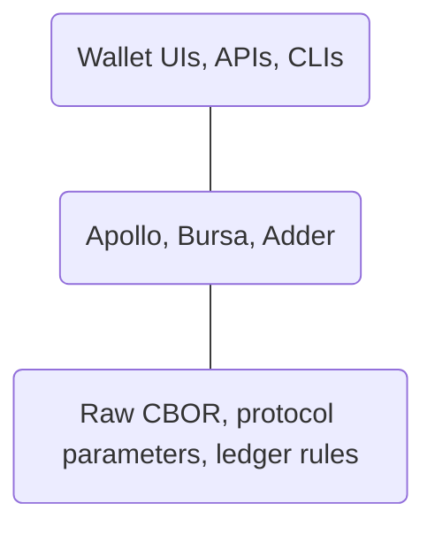
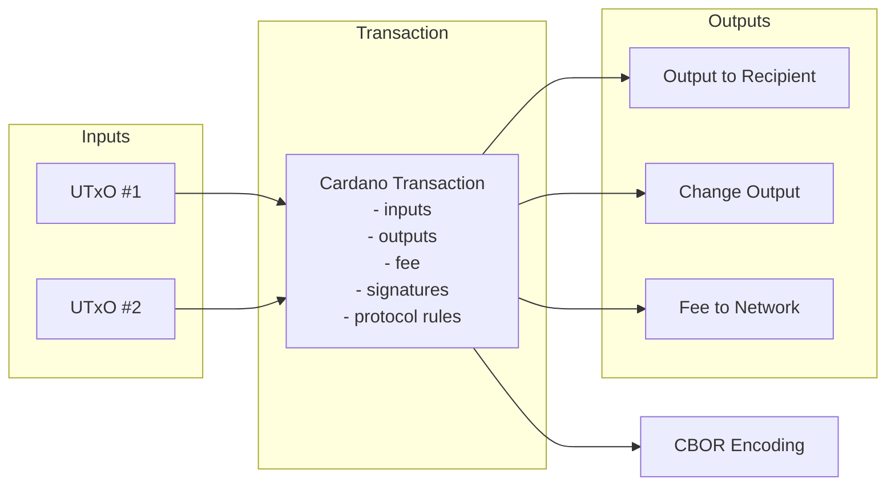

# SLT 100.4: I understand why Apollo was built and what problems it solves

## Apollo – Background and Purpose

[Apollo](https://github.com/Salvionied/apollo/tree/master) is a Go library for building Cardano transactions. It abstracts away the low-level transaction formats and protocol mechanics, giving developers a structured way to assemble, sign, and submit transactions without dealing directly with raw CBOR or ledger internals.

For Go developers, Apollo plays a role similar to cardano-cli, Mesh, or PyCardano—but is designed specifically for programmatic use inside Go applications.

This lesson explains **why Apollo exists**, **what problems it solves**, and **how it fits into the Cardano Go ecosystem**.

---

## Prerequisites

Before this lesson, you should:

- Understand the basic Cardano UTxO model (Where transactions are fundamental which consume inputs, have parameters, and produce outputs)  --> UTxO crash course in Aiken-Lang 
- Be **comfortable reading** Go code (even if you cannot yet write it fluently)  --> Any Go course on Youtube
- Have a general sense of what a blockchain transaction is --> PPPBL.io or [Cardano Developer Portal](https://developers.cardano.org/)

No coding is required in this lesson. You do not need to understand smart contracts, Plutus, or on-chain validation details yet — this lesson focuses only on a board understanding of Apollo.

---

## The Problem Apollo Solves

Conceptually, Apollo fits here in the Cardano Stack:



- **Below**: Raw CBOR, protocol parameters, ledger rules
- **Above**: Wallet UIs, APIs, CLIs
- **Alongside**: Other Cardano development libraries (Bursa, Adder)

You can think of Apollo as a **transaction construction engine**:

- It does not manage wallets for you
- It does not run a node
- It does not store keys long-term
- It focuses on *correct transaction assembly*

---
## First Look at Cardano Transactions

At the ledger level, a Cardano transaction must:

- Consume one or more UTxOs
- Produce one or more outputs
- Preserve value (inputs = outputs + fees)
- Meet protocol rules (fees, minimum ADA, size limits)
- Be correctly signed

All of this is ultimately encoded as **CBOR**, a compact binary format.



While the Cardano CLI can build transactions step by step, doing this programmatically—especially in Go—quickly becomes complex and error-prone.

**Apollo exists to bridge this gap.**

It lets developers express *transaction intent* (who pays whom, how much, under what conditions) while handling the  details automatically.

---

## A First Look at Code: CLI vs Apollo

This lesson does not require you to *write* code, but it does expect you to begin **reading and understanding** it. To make Apollo's value concrete, it helps to compare a traditional Cardano CLI workflow with the equivalent Apollo code.

The goal here is not to memorize commands or syntax, but to notice the *shape* of the logic and where complexity lives.

### Building a Simple Transaction with the Cardano CLI (Pseudo Code)

A basic ADA transfer using the Cardano CLI typically involves multiple explicit steps:

```bash
# 1. Query UTxOs at the sender address
cardano-cli query utxo \
  --address $SENDER_ADDR \
  --testnet-magic 1 \
  --out-file utxos.json

# 2. Build the raw transaction
cardano-cli transaction build \
  --tx-in <UTXO>#<INDEX> \
  --tx-out $RECIPIENT_ADDR+2000000 \
  --change-address $SENDER_ADDR \
  --testnet-magic 1 \
  --out-file tx.raw

# 3. Sign the transaction
cardano-cli transaction sign \
  --tx-body-file tx.raw \
  --signing-key-file payment.skey \
  --testnet-magic 1 \
  --out-file tx.signed

# 4. Submit the transaction
cardano-cli transaction submit \
  --tx-file tx.signed \
  --testnet-magic 1
```

When using the CLI, **you are responsible for**:

- Selecting UTxOs manually
- Managing intermediate files
- Ensuring fees and change are correct
- Executing steps in the correct order

This explicitness is powerful—but difficult to embed inside applications.

---

### The Same Intent Expressed with Apollo (Read-Only)

With Apollo, the same intent can be expressed declaratively in Go:

```go
package main

import (
    "encoding/hex"
    "fmt"

    // CBOR is the binary format Cardano uses on-chain
    "github.com/fxamacker/cbor/v2"

    // Apollo is the transaction-building library
    "github.com/Salvionied/apollo"

    // BlockFrostChainContext is a ChainContext implementation
    // that knows how to query the Cardano blockchain via Blockfrost
    "github.com/Salvionied/apollo/txBuilding/Backend/BlockFrostChainContext"

    // Network / environment constants (PREVIEW, PREPROD, MAINNET, etc.)
    "github.com/Salvionied/apollo/constants"
)

func main() {
    // ---------------------------------------------------------------------
    // 1) Create a ChainContext (how Apollo learns about the blockchain)
    // ---------------------------------------------------------------------
    // The ChainContext is responsible for:
    // - fetching UTxOs
    // - fetching protocol parameters (fees, limits, etc.)
    // - submitting transactions
    //
    // Apollo itself does NOT talk to the blockchain directly.
    // It relies on a ChainContext like this one.
    bfc, err := BlockFrostChainContext.NewBlockfrostChainContext(
        constants.BLOCKFROST_BASE_URL_PREVIEW, // Blockfrost API endpoint
        int(constants.PREVIEW),                // Network (Preview testnet)
        "blockfrost_api_key",                  // API key
    )
    if err != nil { //typical Go Error handling
        panic(err)
    }

    // ---------------------------------------------------------------------
    // 2) Create an Apollo transaction builder
    // ---------------------------------------------------------------------
    // Apollo separates:
    // - the builder (constructs transactions)
    // - the ChainContext (provides blockchain data)
    //
    // Here initalize a Tx builder (an empty backend) ready for tx data.
    cc := apollo.NewEmptyBackend()
    apollob := apollo.New(&cc)

    // ---------------------------------------------------------------------
    // 3) Load a wallet from a mnemonic
    // ---------------------------------------------------------------------
    // This derives a payment keypair and address from the mnemonic.
    // The wallet provides:
    // - the sender address
    // - signing keys for the transaction
    SEED := "your mnemonic here"
    apollob, err = apollob.SetWalletFromMnemonic(SEED, constants.PREVIEW)
    if err != nil {
        panic(err)
    }

    // Set the wallet address as the change address.
    // Any leftover ADA and / or Tokens after fees will be sent back here.
    apollob, err = apollob.SetWalletAsChangeAddress()
    if err != nil {
        panic(err)
    }

    // ---------------------------------------------------------------------
    // 4) Query UTxOs for the wallet address
    // ---------------------------------------------------------------------
    // This is equivalent to:
    //   cardano-cli query utxo --address <addr> ...
    //
    // We explicitly fetch UTxOs here to show where they come from.
    utxos, err := bfc.Utxos(*apollob.GetWallet().GetAddress())
    if err != nil {
        panic(err)
    }

    // ---------------------------------------------------------------------
    // 5) Declare transaction intent and finalize
    // ---------------------------------------------------------------------
    // - Add the available UTxOs as possible inputs
    // - Declare an output / PayToAddress (send ADA to another address)
    // - Complete() selects inputs, calculates fees, and balances the tx
    apollob, err = apollob.
        AddLoadedUTxOs(utxos...).
        PayToAddressBech32("your address here", 1_000_000).
        Complete()
    if err != nil {
        panic(err)
    }

    // ---------------------------------------------------------------------
    // 6) Sign the transaction
    // ---------------------------------------------------------------------
    // This attaches the required signatures using the wallet keys.
    apollob = apollob.Sign()

    // ---------------------------------------------------------------------
    // 7) Inspect the raw transaction
    // ---------------------------------------------------------------------
    // At the ledger level, a Cardano transaction is CBOR-encoded.
    // This step shows the exact bytes that will be submitted on-chain.
    tx := apollob.GetTx()
    cborred, err := cbor.Marshal(tx)
    if err != nil {
        panic(err)
    }

    // Prints the CBOR
    fmt.Println("CBOR tx:", hex.EncodeToString(cborred))

    // ---------------------------------------------------------------------
    // 8) Submit the transaction
    // ---------------------------------------------------------------------
    // This sends the signed CBOR transaction to the network via Blockfrost.
    tx_id, err := bfc.SubmitTx(*tx)
    if err != nil {
        panic(err)
    }

    // Print the transaction hash returned by the network
    fmt.Println("Tx hash:", hex.EncodeToString(tx_id.Payload))
}


```

At this stage, you do **not** need to understand every function call. Instead, notice what is different:

- There are no intermediate files (Remember the files from the CLI - utxos.json, tx.raw, tx.signed)
- UTxO selection is implicit 
- Fee calculation is automatic
- The transaction is only finalized at `Complete()`

The complexity still exists—but it is handled *by the library*, according to protocol rules.

This contrast is the core motivation for using Apollo.

---

## Design Philosophy

Apollo follows a few important design principles.

### 1. Explicit Intent, Automatic Mechanics

You describe *what* you want the transaction to do:

- Spend from this address
- Pay this address this amount
- Attach metadata
- Require these signers

Apollo handles *how* all that becomes a valid ledger transaction.

---

### 2. Builder Pattern for Transactions

Apollo uses a fluent builder pattern:

- Each method adds a constraint or requirement
- The transaction is not finalized until the final step

This mirrors how Cardano transactions actually work: they are not 'sent' until all requirements are met.

---

### 3. Network-Aware by Design

Apollo does not hard-code protocol rules. Instead, it relies on a pluggable ChainContext to supply network-specific data.

A ChainContext can fetch (or provide) things like:
    - protocol parameters
    - UTxOs at addresses
    - current tip / era info
    - network configuration (mainnet vs testnet)

Apollo supports multiple ChainContext implementations (Ogmios, Blockfrost, Maestro, UTxORPC, etc.), so the same transaction-building code can work across different environments.

---

## What Apollo Does Not Do

It's important to understand Apollo's boundaries.

Apollo does **not**:

- Custody funds
- Manage wallet recovery phrases for you
- Wait for transaction confirmation
- Abstract away Cardano concepts like UTxOs or fees

These are intentional choices.

Apollo is a **developer library**, not a wallet.

---

## Key Concepts You Will Use Later

You will encounter these ideas repeatedly in later lessons:

- **Chain Context**  
  How Apollo talks to the Cardano network (e.g., Blockfrost, Koios, local node)

- **Transaction Builder**  
  An object that accumulates transaction requirements

- **UTxO Selection**  
  Automatic selection of inputs to fund outputs and fees

- **Signing**  
  Applying cryptographic signatures after the transaction is fully constructed

You do not need to master these yet—only recognize them.

---

## Why This Matters for Go Developers

Cardano's tooling ecosystem has historically been CLI-first and Haskell-centric.

Apollo makes it possible to:

- Build Cardano transactions natively in Go
- Integrate Cardano logic into Go services and CLIs
- Learn Cardano concepts without first learning Haskell or ledger internals

---

## What's Next

In the next lessons, you will:

- Create a real transaction using Apollo (SLT:102.2)
- Load UTxOs from a testnet address
- Build, sign, and submit a transaction
- See the result on a Cardano block explorer

At that point, Apollo will stop being an abstraction and start feeling like a tool.

---

## Summary

- Apollo is a Go library for building Cardano transactions
- It abstracts transaction mechanics, not Cardano concepts
- It uses a builder pattern aligned with how the ledger works
- It enables Go developers to participate directly in Cardano development

You now have the conceptual grounding needed to build your first transaction.
