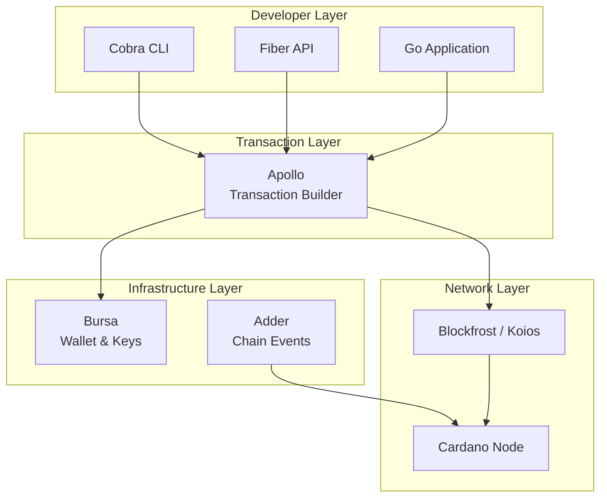
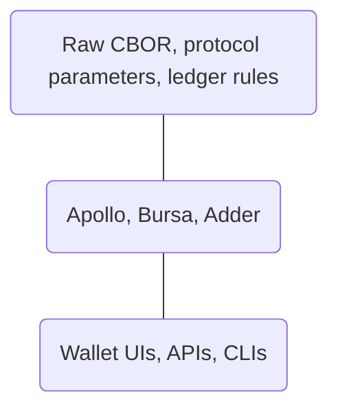

# SLT 100.4: I understand why Apollo was built and what problems it solves

## Apollo – Background and Purpose

Apollo is a Go library for building Cardano transactions. It sits between low-level Cardano transaction formats (CBOR, protocol parameters, UTxOs) and higher-level developer tooling, making it possible to construct valid transactions without manually assembling every ledger detail.

This lesson explains **why Apollo exists**, **what problems it solves**, and **how it fits into the Cardano Go ecosystem**.

---

## Prerequisites

Before this lesson, you should:

- Understand the basic Cardano UTxO model
- Be **comfortable reading** Go code (even if you cannot yet write it fluently)
- Have a general sense of what a blockchain transaction is

No coding is required in this lesson.

---

## The Problem Apollo Solves

At the ledger level, a Cardano transaction must:

- Consume one or more UTxOs
- Produce one or more outputs
- Preserve value (inputs = outputs + fees)
- Meet protocol rules (fees, minimum ADA, size limits)
- Be correctly signed

All of this is ultimately encoded as **CBOR**, a compact binary format.

While the Cardano CLI can build transactions step by step, doing this programmatically—especially in Go—quickly becomes complex and error-prone.

**Apollo exists to bridge this gap.**

It lets developers express *transaction intent* (who pays whom, how much, under what conditions) while handling the  details automatically.

---

## Where Apollo Fits in the Cardano Stack

To make this more concrete, the diagram below shows how Apollo fits into a typical Cardano Go developer stack:



This diagram highlights Apollo’s role as the **bridge between application logic and the Cardano ledger**: applications express intent, Apollo constructs valid transactions, and network services provide the data and submission path needed to interact with the blockchain.

Conceptually, Apollo sits here:

- **Below**: Wallet UIs, APIs, CLIs
- **Above**: Raw CBOR, protocol parameters, ledger rules
- **Alongside**: Other Cardano infrastructure libraries (Bursa, Adder)



You can think of Apollo as a **transaction construction engine**:

- It does not manage wallets for you
- It does not run a node
- It does not store keys long-term
- It focuses on *correct transaction assembly*

---

## A First Look at Code: CLI vs Apollo

This lesson does not require you to *write* code, but it does expect you to begin **reading and understanding** it. To make Apollo’s value concrete, it helps to compare a traditional Cardano CLI workflow with the equivalent Apollo code.

The goal here is not to memorize commands or syntax, but to notice the *shape* of the logic and where complexity lives.

### Building a Simple Transaction with the Cardano CLI (Conceptual)

A basic ADA transfer using the Cardano CLI typically involves multiple explicit steps:

```bash
# 1. Query UTxOs at the sender address
cardano-cli query utxo \
  --address $SENDER_ADDR \
  --testnet-magic 1 \
  --out-file utxos.json

# 2. Build the raw transaction
cardano-cli transaction build \
  --tx-in <UTXO>#<INDEX> \
  --tx-out $RECIPIENT_ADDR+2000000 \
  --change-address $SENDER_ADDR \
  --testnet-magic 1 \
  --out-file tx.raw

# 3. Sign the transaction
cardano-cli transaction sign \
  --tx-body-file tx.raw \
  --signing-key-file payment.skey \
  --testnet-magic 1 \
  --out-file tx.signed

# 4. Submit the transaction
cardano-cli transaction submit \
  --tx-file tx.signed \
  --testnet-magic 1
```

When using the CLI, **you are responsible for**:

- Selecting UTxOs manually
- Managing intermediate files
- Ensuring fees and change are correct
- Executing steps in the correct order

This explicitness is powerful—but difficult to embed inside applications.

---

### The Same Intent Expressed with Apollo (Read-Only)

With Apollo, the same intent can be expressed declaratively in Go:

```go
tx, err := apolloBuilder.
    SetWalletFromBech32(senderAddr).
    PayToAddress(recipientAddr, 2_000_000).
    Complete()
```

At this stage, you do **not** need to understand every function call. Instead, notice what is different:

- There are no intermediate files
- UTxO selection is implicit
- Fee calculation is automatic
- The transaction is only finalized at `Complete()`

The complexity still exists—but it is handled *by the library*, according to protocol rules.

This contrast is the core motivation for using Apollo.

---

## Design Philosophy

Apollo follows a few important design principles.

### 1. Explicit Intent, Automatic Mechanics

You describe *what* you want the transaction to do:

- Spend from this address
- Pay this address this amount
- Attach metadata
- Require these signers

Apollo handles *how* all that becomes a valid ledger transaction.

---

### 2. Builder Pattern for Transactions

Apollo uses a fluent builder pattern:

- Each method adds a constraint or requirement
- The transaction is not finalized until the final step
- Errors surface early if constraints cannot be satisfied

This mirrors how Cardano transactions actually work: they are not 'sent' until all requirements are met.

---

### 3. Network-Aware by Design

Apollo does not hard-code protocol rules.

Instead, it queries:

- Protocol parameters
- UTxOs at addresses
- Network configuration

This allows the same code to work across:

- preprod
- preview
- mainnet

(as long as the network context is configured correctly).

---

## What Apollo Does Not Do

It’s important to understand Apollo’s boundaries.

Apollo does **not**:

- Custody funds
- Manage wallet recovery phrases for you
- Wait for transaction confirmation
- Abstract away Cardano concepts like UTxOs or fees

These are intentional choices.

Apollo is a **developer library**, not a wallet.

---

## Key Concepts You Will Use Later

Here is the code again for referenece:

```go
tx, err := apolloBuilder.
    SetWalletFromBech32(senderAddr).
    PayToAddress(recipientAddr, 2_000_000).
    Complete()
```

You will encounter these ideas repeatedly in later lessons:

- **Chain Context**  
  How Apollo talks to the Cardano network (e.g., Blockfrost, Koios, local node)

- **Transaction Builder**  
  An object that accumulates transaction requirements

- **UTxO Selection**  
  Automatic selection of inputs to fund outputs and fees

- **Signing**  
  Applying cryptographic signatures after the transaction is fully constructed

You do not need to master these yet—only recognize them.

---

## Why This Matters for Go Developers

Cardano’s tooling ecosystem has historically been CLI-first and Haskell-centric.

Apollo makes it possible to:

- Build Cardano transactions natively in Go
- Integrate Cardano logic into Go services and CLIs
- Learn Cardano concepts without first learning Haskell or ledger internals

This course uses Apollo as a foundation because it allows you to focus on **learning Cardano**, not wrestling with encoding formats.

---

## What’s Next

In the next lessons, you will:

- Create a real transaction using Apollo (SLT:102.2)
- Load UTxOs from a testnet address
- Build, sign, and submit a transaction
- See the result on a Cardano block explorer

At that point, Apollo will stop being an abstraction and start feeling like a tool.

---

## Summary

- Apollo is a Go library for building Cardano transactions
- It abstracts transaction mechanics, not Cardano concepts
- It uses a builder pattern aligned with how the ledger works
- It enables Go developers to participate directly in Cardano development

You now have the conceptual grounding needed to build your first transaction.
