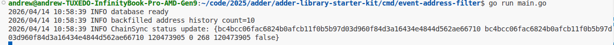
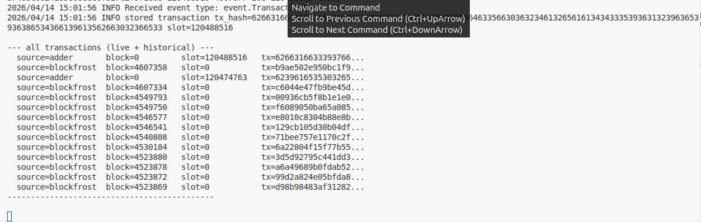

# Combine Live Event Data with Historical Query Data

In Lessons 202.3 and 202.4, you built a pipeline that stores transactions arriving at a watched address and handles rollbacks correctly. Adder gives you live data — events as they happen. But it cannot tell you what happened at that address *before* your indexer started running.

How much chain history Dolos holds depends on how you've configured it and how much you can run locally. If you don't have a full archive node, there will be a gap between what Dolos knows and the full transaction history of an address. This lesson adds a Blockfrost query that runs at startup to backfill the SQLite database with historical transactions — so your local db holds both history from Blockfrost and live events from Adder.

---

## Prerequisites

- Completed Lessons 202.1–202.4
- A Blockfrost preprod project ID — get one at [blockfrost.io](https://blockfrost.io)
- Your `cmd/event-address-filter/main.go` from 202.4 open and working

---

## What We're Building

```
startup
  └── fetchAndStoreHistory()   ← Blockfrost: backfill last 10 txs for address

pipeline running
  └── handleEvent()            ← Adder: store each new live tx as it arrives

SQLite db
  ├── source=blockfrost  block_height=4549793  tx=00936cb5...
  ├── source=blockfrost  block_height=4549750  tx=f6089050...
  └── source=adder       slot=120474763        tx=62396165...
```

The two sources write to the same table. `INSERT OR IGNORE` on `tx_hash` prevents duplicates.

---

## Step 1: Install godotenv

Rather than exporting environment variables manually, use a `.env` file. The `godotenv/autoload` package loads it automatically when your program starts:

```bash
go get github.com/joho/godotenv
```

Create a `.env` file in `cmd/event-address-filter/`:

```
BLOCKFROST_KEY=preprodYourKeyHere
```

---

## Step 2: Update imports

```go
import (
    "database/sql"
    "encoding/json"
    "fmt"
    "log/slog"
    "net/http"
    "os"

    "github.com/blinklabs-io/adder/event"
    filter_chainsync "github.com/blinklabs-io/adder/filter/chainsync"
    filter_event "github.com/blinklabs-io/adder/filter/event"
    input_chainsync "github.com/blinklabs-io/adder/input/chainsync"
    output_embedded "github.com/blinklabs-io/adder/output/embedded"
    "github.com/blinklabs-io/adder/pipeline"
    _ "github.com/joho/godotenv/autoload"
    "github.com/kelseyhightower/envconfig"
    _ "modernc.org/sqlite"
)
```

The `_` on `godotenv/autoload` imports it for its side effect only — it runs `init()` which loads your `.env` file into the environment before `main()` runs. Same pattern as the SQLite driver.

---

## Step 3: Add package-level vars

Below the existing `var db *sql.DB`, add:

```go
var blockfrostKey string
var watchedAddress = "your_preprod_address_here"
```

`watchedAddress` is used in both the Adder address filter and the Blockfrost query, so keeping it as a package-level var avoids duplication.

Now update `filterChainsync` to use it instead of the hardcoded string:

```go
filterChainsync := filter_chainsync.New(
    filter_chainsync.WithAddresses([]string{watchedAddress}),
)
```

---

## Step 4: Assign blockfrostKey in main()

After `envconfig.Process`, add:

```go
blockfrostKey = os.Getenv("BLOCKFROST_KEY")
```

`godotenv/autoload` has already loaded the `.env` file by this point, so `os.Getenv` finds the value.

---

## Step 5: Add the Blockfrost struct and function

Add this below `updateStatus`:

```go
type blockfrostTx struct {
    TxHash      string `json:"tx_hash"`
    BlockHeight int    `json:"block_height"`
    BlockTime   int64  `json:"block_time"`
}

func fetchAndStoreHistory(address string) error {
    url := "https://cardano-preprod.blockfrost.io/api/v0/addresses/" + address + "/transactions?order=desc&count=10"
    req, err := http.NewRequest("GET", url, nil)
    if err != nil {
        return err
    }
    req.Header.Set("project_id", blockfrostKey)

    resp, err := http.DefaultClient.Do(req)
    if err != nil {
        return err
    }
    defer resp.Body.Close()

    var txs []blockfrostTx
    if err := json.NewDecoder(resp.Body).Decode(&txs); err != nil {
        return err
    }

    for _, tx := range txs {
        _, err := db.Exec(
            `INSERT OR IGNORE INTO transactions (tx_hash, block_height, source) VALUES (?, ?, 'blockfrost')`,
            tx.TxHash, tx.BlockHeight,
        )
        if err != nil {
            return fmt.Errorf("failed to store historical tx: %w", err)
        }
    }

    slog.Info("backfilled address history", "count", len(txs))
    return nil
}
```

The Blockfrost address transactions endpoint returns `block_height` but not `slot` — so `slot` stays NULL for these rows. That is why the schema from 202.3 has `slot INTEGER` (nullable) rather than `slot INTEGER NOT NULL`.

---

## Step 6: Call fetchAndStoreHistory in main()

After `slog.Info("database ready")` and before starting the pipeline:

```go
err = fetchAndStoreHistory(watchedAddress)
if err != nil {
    slog.Warn("blockfrost backfill failed", "err", err)
}
```

This runs once at startup. Every time the program starts, it fetches the 10 most recent transactions for the address and inserts any it hasn't seen before. Already-stored hashes are skipped by `INSERT OR IGNORE`.

---

## Step 7: Update handleEvent query

The query in `handleEvent` was written for the 202.3 schema. Update it to show all columns:

```go
rows, err := db.Query(`SELECT tx_hash, slot, block_height, source, stored_at FROM transactions ORDER BY stored_at DESC`)
if err != nil {
    return err
}
defer rows.Close()

fmt.Println("\n--- all transactions (live + historical) ---")
for rows.Next() {
    var txHash, source, storedAt string
    var slot sql.NullInt64
    var blockHeight sql.NullInt64
    rows.Scan(&txHash, &slot, &blockHeight, &source, &storedAt)
    fmt.Printf("  source=%-10s  block=%-8v  slot=%-10v  tx=%s...\n",
        source, blockHeight.Int64, slot.Int64, txHash[:16])
}
fmt.Println("--------------------------------------------\n")
```

`sql.NullInt64` is the null-safe integer type — necessary because `slot` and `block_height` are nullable depending on the source.

---

## Step 8: Run it

```bash
go run cmd/event-address-filter/main.go
```

You should see:

```
database ready
backfilled address history count=10
ChainSync status update: ...
```



Query the database directly to see the backfilled rows:

```bash
sqlite3 indexer.db "SELECT source, block_height, slot, tx_hash FROM transactions ORDER BY stored_at DESC"
```

Now send a transaction to your watched address. When it lands you will see a new row with `source=adder` and a `slot` value alongside the Blockfrost rows:



---

## What Just Happened

Two independent data sources write to the same SQLite table:

- **Blockfrost** fills in history from before the indexer started — `block_height` populated, `slot` null
- **Adder** captures events as they arrive live — `slot` populated, `block_height` null

The `source` column makes it clear where each row came from. The `UNIQUE` constraint on `tx_hash` ensures the same transaction is never stored twice, regardless of which source saw it first.

This is the pattern behind most real Cardano applications: a query provider for historical depth, a live event stream for freshness.

---

## Common Issues

### `backfilled address history count=0`
The address has no transaction history on preprod. Send a transaction from the faucet first, wait for confirmation, then restart.

### `blockfrost backfill failed`
Check that your `.env` file is in the same directory you run from (`cmd/event-address-filter/`) and that the key is a preprod key (starts with `preprod`).

### Adder rows not appearing
Make sure Dolos is running before starting the program. Adder starts tailing from the current tip — send a transaction *after* the pipeline is running.

---

## Practice Tasks

1. The backfill currently fetches the 10 most recent transactions. Change `count=10` to `count=20` — does the number of inserted rows increase, or does `INSERT OR IGNORE` absorb some?
2. Add a formatted timestamp column to the terminal output using `block_time` from the Blockfrost response — store it in a new `block_time` column and display it with `time.Unix(blockTime, 0).Format(time.RFC3339)`
3. Think through: what would need to change if you wanted to watch multiple addresses? Where would `watchedAddress` need to become a slice?

---

## What's Next

- Module 203: Building and submitting transactions with Apollo
